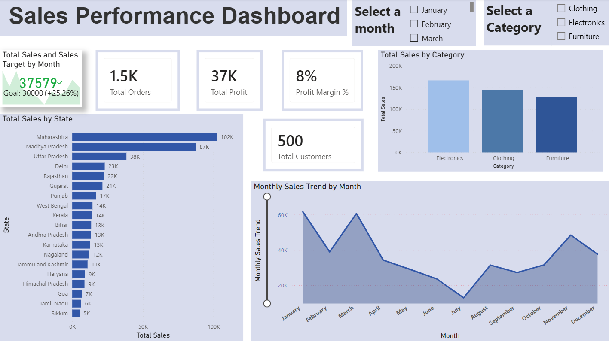
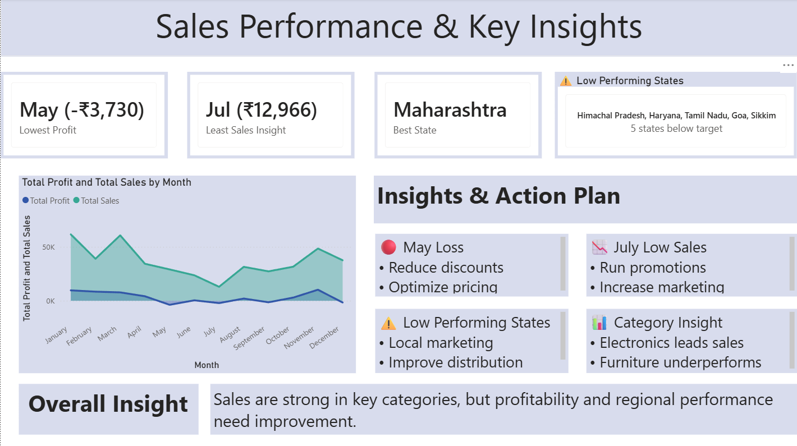

# 📊 PowerBI Sales Performance Dashboard

## 🔍 Overview

This project presents an interactive Power BI dashboard to analyze sales, profit, and regional performance. It highlights key insights and provides actionable recommendations to improve business outcomes.

---

## 🎯 Key Features

* 📈 Sales and Profit Analysis by Month
* 🗺️ State-wise Performance Insights
* 📊 Category-wise Sales Comparison
* ⚠️ Identification of Low-performing Regions
* 💡 Actionable Insights & Recommendations

## 🧠 Insights

* 🔴 Loss observed in May due to negative profit margin
* 📉 Low sales in July indicating reduced demand
* ⚠️ Certain states show weak performance
* 📊 Electronics is the top-performing category

## 🚀 Tools & Technologies

* Power BI
* DAX
* Data Visualization

## 📸 Dashboard Preview

### Main Dashboard

### Insights Page

  
## 📌 Conclusion

The dashboard helps identify performance gaps and supports data-driven decision-making through clear insights and recommended actions.
